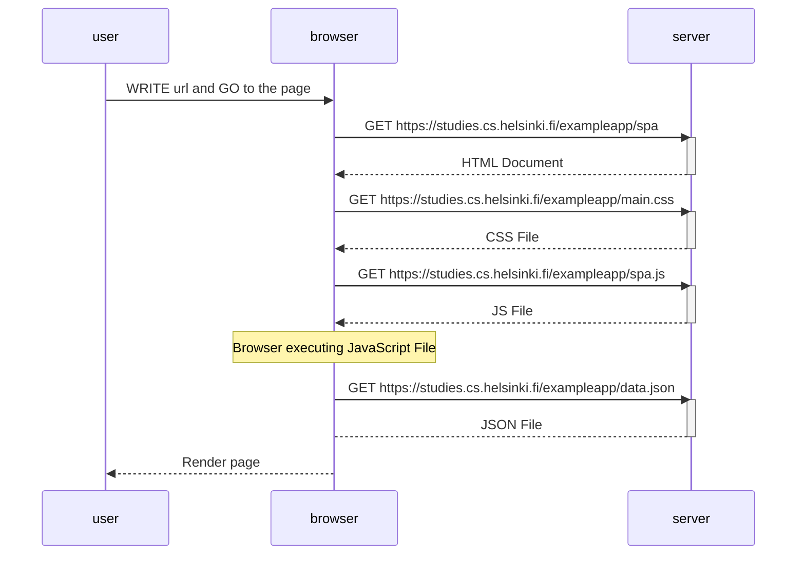

```mermaid
sequenceDiagram

    participant user
    participant browser
    participant server

    user->>browser: WRITE url and GO to the page

    browser->>server: GET https://studies.cs.helsinki.fi/exampleapp/spa
    activate server
    server-->>browser: HTML Document
    deactivate server

    browser->>server: GET https://studies.cs.helsinki.fi/exampleapp/main.css
    activate server
    server-->>browser: CSS File
    deactivate server

    browser->>server: GET https://studies.cs.helsinki.fi/exampleapp/spa.js
    activate server
    server-->>browser: JS File
    deactivate server

    Note over browser: Browser executing JavaScript File

    browser->>server: GET https://studies.cs.helsinki.fi/exampleapp/data.json
    activate server
    server-->browser: JSON File
    deactivate server

    browser-->>user: Render page

```
