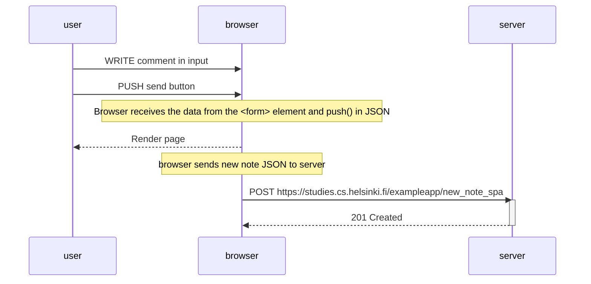

```mermaid
sequenceDiagram

    participant user
    participant browser
    participant server

    user->>browser: WRITE comment in input
    user->>browser: PUSH send button

    Note over browser: Browser receives the data from the <form> element and push() in JSON

    browser-->>user: Render page

    Note over browser: browser sends new note JSON to server

    browser->>server: POST https://studies.cs.helsinki.fi/exampleapp/new_note_spa
    activate server
    server-->>browser: 201 Created
    deactivate server

```
