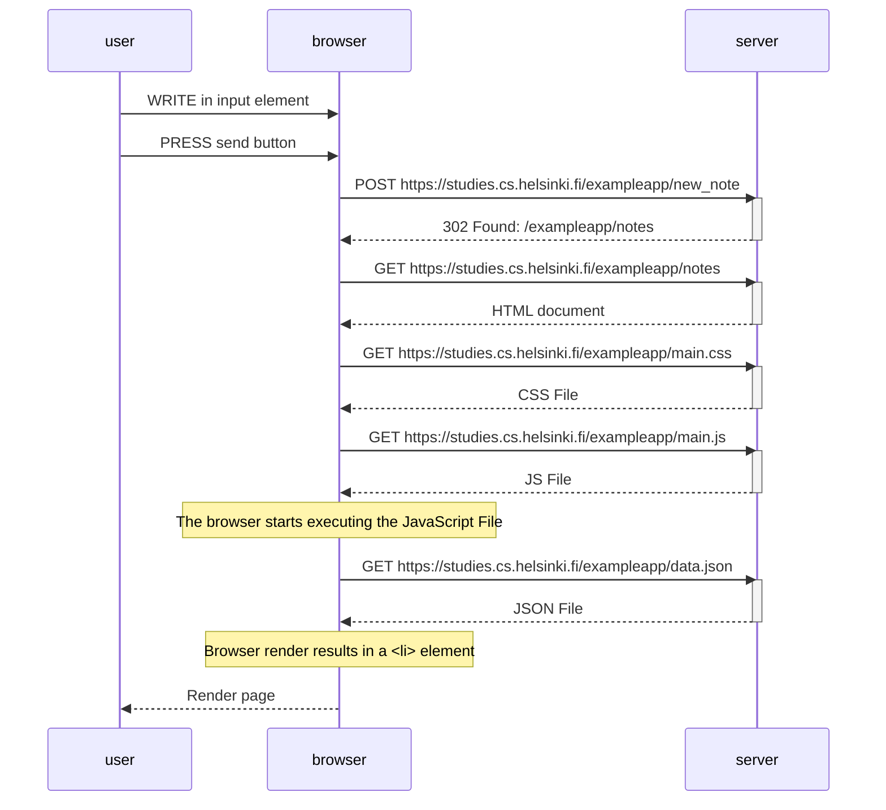

```mermaid
sequenceDiagram
    participant user
    participant browser
    participant server

    user->>browser: WRITE in input element
    user->>browser: PRESS send button
    browser->>server: POST https://studies.cs.helsinki.fi/exampleapp/new_note
    activate server
    server-->>browser: 302 Found: /exampleapp/notes
    deactivate server

    browser->>server: GET https://studies.cs.helsinki.fi/exampleapp/notes
    activate server
    server-->>browser: HTML document
    deactivate server

    browser->>server: GET https://studies.cs.helsinki.fi/exampleapp/main.css
    activate server
    server-->>browser: CSS File
    deactivate server
  
    browser->>server: GET https://studies.cs.helsinki.fi/exampleapp/main.js
    activate server
    server-->>browser: JS File
    deactivate server

    Note over browser: The browser starts executing the JavaScript File

    browser->>server: GET https://studies.cs.helsinki.fi/exampleapp/data.json
    activate server
    server-->>browser: JSON File
    deactivate server

    Note over browser: Browser render results in a <li> element

    browser-->>user: Render page
  
   
```
